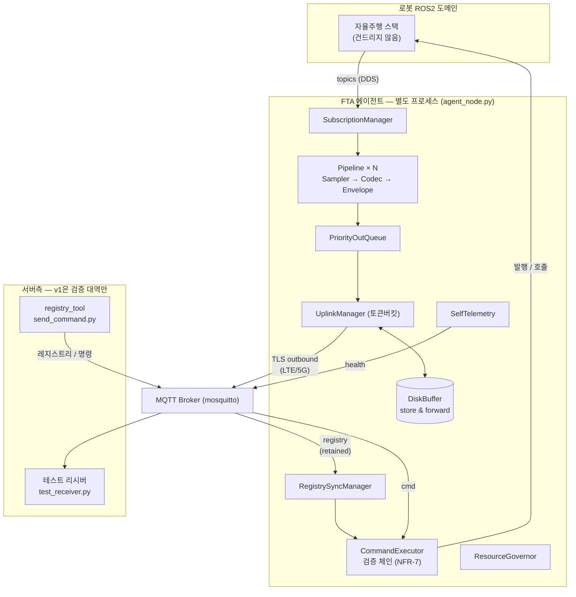
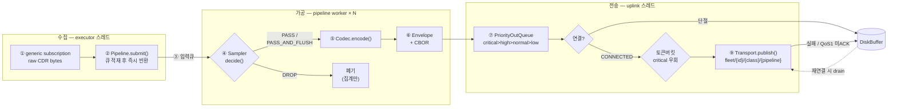
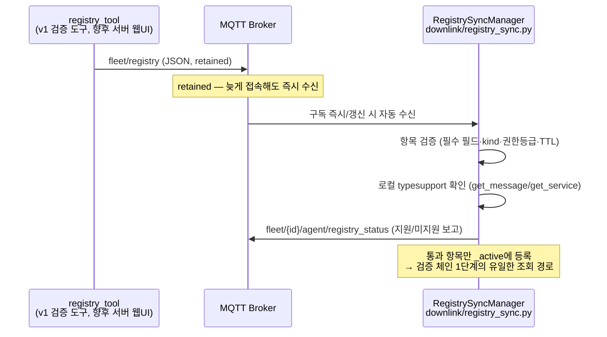
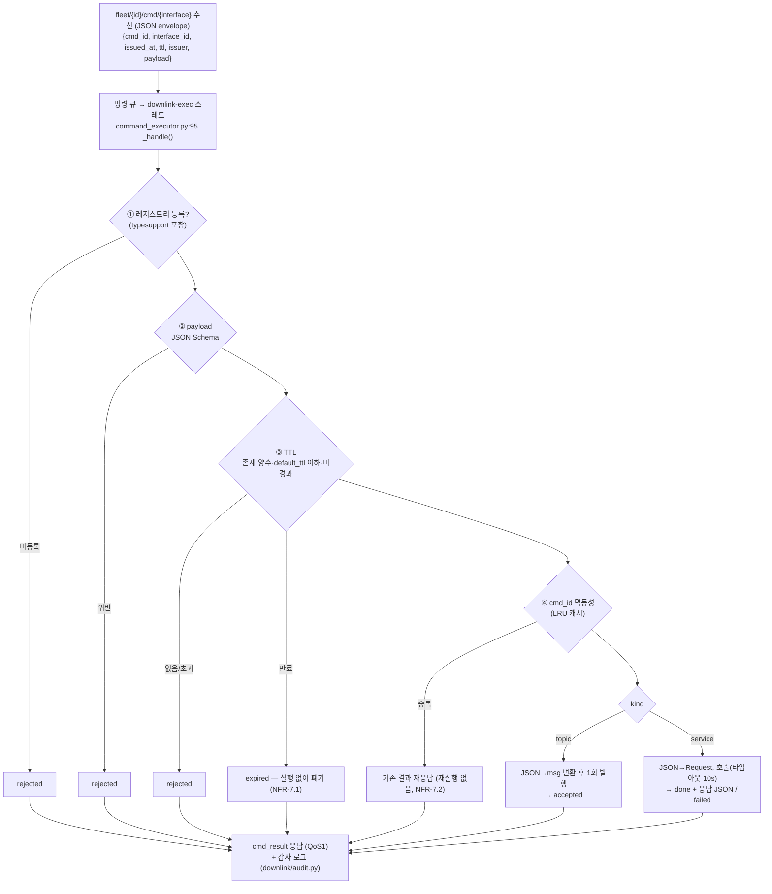

# FTA 데이터 흐름 상세 (코드베이스 기준)

> 각 단계에 실제 소스 경로를 병기한다. 컴포넌트 책임 정의는
> [02_아키텍처설계서.md](02_아키텍처설계서.md), 설정 키는
> [config_reference.md](config_reference.md) 참조.
>
> PDF 버전: [pdf/07_데이터흐름.pdf](pdf/07_데이터흐름.pdf)
> (재생성: `python3 tools/md_to_pdf.py docs/07_데이터흐름.md -o docs/pdf/07_데이터흐름.pdf`)

## 0. 전체 조감도

FTA는 로봇 안에서 자율주행 스택과 **분리된 별도 프로세스**로 동작한다. 데이터는
두 방향으로 흐른다:

- **업링크** — ROS2 토픽을 구독해 샘플링·인코딩한 뒤 MQTT로 서버에 올린다.
  네트워크가 끊기면 디스크에 보존하고 복구 시 재전송한다.
- **다운링크** — 서버가 배포한 인터페이스 레지스트리를 동기화하고, 수신 명령이
  검증 체인을 모두 통과한 경우에만 ROS2 topic 발행 / service 호출로 실행한다.

두 방향 모두 **설정(YAML)과 레지스트리로만** 대상이 결정되며, 토픽명이나 명령
대상이 소스코드에 하드코딩되는 경로는 존재하지 않는다.



- 조립·기동 순서: `fta_agent/agent_node.py` — ConfigLoader → Transport(레지스트리 생성) →
  DiskBuffer → UplinkManager → Pipeline×N(구독) → 다운링크 → 관측성 → spin

---

## 1. 업링크: ROS 토픽 → 서버

### 1.1 단계별 흐름

단계 번호는 아래 1.2 표의 행과 대응한다 (코드 경로·규칙은 표 참조).



### 1.2 각 단계 상세

| # | 단계 | 코드 | 핵심 규칙 |
|---|---|---|---|
| ① | 구독 | `core/subscription_manager.py` | `raw=True` — 콜백은 역직렬화 없이 CDR bytes 그대로 수신. 타입 클래스는 `rosidl` introspection으로 동적 로드 (`agent_node.py`의 `get_message`) |
| ② | 콜백 | `core/pipeline.py:79` | **큐 적재 후 즉시 반환** (불변 조건 3). 큐 포화·거버너 pause 시 드롭 집계만 |
| ③ | worker | `core/pipeline.py:90` | 파이프라인당 스레드 1개. 여기서부터 무거운 작업 허용 |
| ④ | 샘플링 | `samplers/` (rate·deadband·event·on_demand·passthrough) | deadband/event만 `msg.ros_msg()`로 지연 역직렬화 (`core/message_view.py`). event는 `PASS_AND_FLUSH` |
| ⑤ | 인코딩 | `codecs/` (cbor·cdr_zstd·jpeg·voxel_zstd) | 결과에 `encoding_id` 포함 (FR-3.3) — 수신측 디코딩 계약 |
| ⑥ | 봉투 | `core/envelope.py` | 서버 계약 (version 필드). seq는 파이프라인별 단조 증가 → 수신측 손실 감지 |
| ⑦ | 우선순위큐 | `core/priority_queue.py` | 포화 정책: low/normal 오래된 것 드롭, high는 같은 파이프라인 최신값 교체(conflation) |
| ⑧ | 업링크 | `core/uplink_manager.py` | 토큰버킷(`core/token_bucket.py`)으로 대역폭 상한, critical은 우회 (NFR-2.5) |
| ⑨ | 전송 | `transports/mqtt_transport.py` | QoS: 상태/bulk=0, critical/이벤트=1(+PUBACK 확인). LWT로 생존 감지 |

### 1.3 단절 시 (store & forward, `core/disk_buffer.py`)

```
단절 감지(publish 실패 or 미연결) → UplinkManager._route_offline():
  critical·이벤트  → events/seg_NNNNNNNN.log 에 append (전량 보존)
  상태(state)     → latest/{pipeline}.rec 덮어쓰기 (최신값만 — FR-5.4)
  bulk           → 폐기

재연결 감지 → drain():
  이벤트 백로그(오래된 것부터) → 최신 상태 스냅샷 → 평시 복귀
  중간 실패 시 세그먼트 보존 후 중단 (QoS1 재전송 중복 허용)
  에이전트 재시작 후에도 파일 스캔으로 복구 (NFR-3.3)
```

### 1.4 스레드 모델

```
rclpy executor (메인)  : 구독 콜백(적재만), 타이머(통계·health·거버너), 서비스
pipeline-{name} × N    : 샘플링·인코딩·봉투
uplink                 : 큐 드레인·토큰버킷·발행·버퍼 라우팅/드레인
paho network loop      : MQTT I/O·재연결 백오프(1→30s)·수신 콜백
downlink-exec          : 명령 검증·실행 (다운링크 활성 시)
```
경계는 전부 큐(스레드 안전)로 연결 — 한 단계의 지연이 콜백/executor를 막지 않는다.

---

## 2. 다운링크: 서버 → ROS (동적 인터페이스)

### 2.1 레지스트리 동기화 (실행 가능 대상의 유일한 출처)



### 2.2 명령 실행 — 검증 체인 (NFR-7.5, 순서 고정·우회 불가)



- JSON↔ROS 변환: `downlink/json_converter.py` — `rosidl` introspection이라
  **타입별 코드 없이 커스텀 타입 대응** (typesupport 설치가 유일한 조건, D7)
- 모든 경로가 `cmd_result` 응답 + 감사 로그로 끝난다 — 무응답 명령 없음 (FR-9.7)
- E-Stop 등 안전 기능은 이 채널에 **의존하지 않는다** (NFR-7.3) — 다운링크 전면
  장애는 정상 시나리오

## 3. 관측성 흐름

```
SelfTelemetry (observability/self_telemetry.py, 10s 타이머)
  ├─ 수집: 파이프라인 stats · 큐/드롭/conflation · 버퍼 pending · 연결 상태
  │        · 레지스트리 snapshot · CPU/RSS/스레드(psutil)
  ├─ fleet/{id}/agent/health (QoS0, heartbeat 겸용 — FR-4.4)
  └─ 로컬 /fta/health (std_msgs/String JSON — 로봇 내 진단, FR-7.2)

ResourceGovernor (observability/resource_governor.py, 5s 타이머)
  └─ CPU>20% 또는 RSS>512MB → bulk 파이프라인 pause() → 80% 미만 회복 시 resume()
     (OS 백스톱: deploy/fta_agent.service 의 CPUQuota/MemoryMax)
```

## 4. v1 검증 구성이 "서버 없이" 성립하는 이유

v1 범위(01 문서 §1.3)는 서버를 제외하고 **계약 + 검증 대역(counterpart)** 만 요구한다:

| 정식 서버의 역할 | v1 검증 대역 | 계약 |
|---|---|---|
| 인제스천 (수신·디코딩·저장) | `fta_tools/test_receiver.py` — envelope 디코딩→jsonl+통계 | envelope CBOR v1, 토픽 네임스페이스 |
| 레지스트리 DB + 웹 등록 UI | `fta_tools/registry_tool.py` — 파일→retained 발행 | 레지스트리 JSON 포맷 |
| 명령 발행 API | `tests/integration/send_command.py` | 명령/응답 envelope |
| 브로커 운영 | 로컬 mosquitto | **persistence + 내구 세션 필수** (M4에서 실측 도출) |

에이전트가 검증한 모든 것은 이 계약 위에서 이루어졌으므로, 서버 프로젝트는 동일
계약을 구현하면 에이전트 수정 없이 접속된다 (03 문서 — 계약이 곧 인터페이스).
